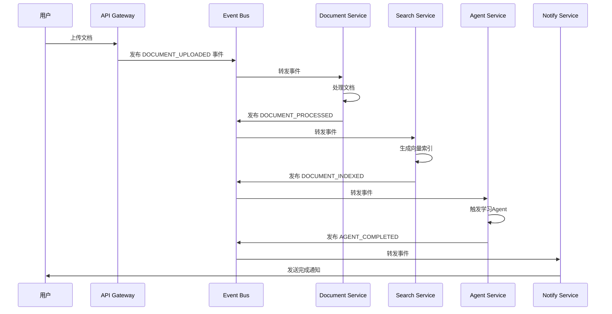

# 事件驱动架构设计方案

## 🎯 架构目标

将当前的单体架构重构为事件驱动的微服务架构，提升系统的可扩展性、响应性和可维护性。

## 🏗️ 微服务设计

### 核心服务架构

```
┌─────────────────┬─────────────────┬─────────────────┬─────────────────┐
│   API Gateway   │  Event Bus      │   Load Balancer  │  Monitoring     │
└─────────────────┴─────────────────┴─────────────────┴─────────┬─────────┘
         │                │                │            │
┌─────────────────────────────────────────────────────────────────────┐
│                    Message Broker (Redis/RabbitMQ)                      │
├─────────────────┬─────────────────┬─────────────────┬─────────────────┬─────────────────┤
│  Document Service │  Search Service   │  Agent Service   │  Notify Service  │  User Service    │
│  (端口: 8003)   │  (端口: 8004)     │  (端口: 8005)    │  (端口: 8006)   │  (端口: 8007)    │
│                 │                 │                 │                 │                  │
│ • PDF解析       │ • 向量检索       │ • 学习Agent     │ • 邮件/微信      │ • 用户管理      │
│ • 文档提取     │ • 语义搜索       │ • 推荐Agent     │ • 系统通知      │ • 权限控制      │
│ • 格式转换     │ • 关键词搜索     │ • 策略Agent     │ • 状态变更      │ • 认证授权      │
│                 │                 │                 │                 │                  │
└─────────────────┴─────────────────┴─────────────────┴─────────┴─────────┴─────────────────┘
         │                │                │            │
┌─────────────────────────────────────────────────────────────────────┐
│                    PostgreSQL Database (主数据库)                         │
│  - knowledge_entries, recommendations, users, events              │
│  - 向量索引 (pgvector), 全文搜索索引                              │
│  - 事件存储表, 工作流状态表                                          │
└─────────────────────────────────────────────────────────────────────┘
```

### 服务职责定义

#### 1. Document Service (文档处理服务)
**端口**: 8003
**职责**:
- 文档接收和预处理
- PDF、Word、Excel文档解析
- 多模态内容提取（文本、图像、表格）
- 文档格式转换和标准化
- 向初始事件发布

**技术栈**: Python + FastAPI + PyPDF2 + python-docx + OpenCV

#### 2. Search Service (搜索服务)
**端口**: 8004
**职责**:
- 向量嵌入生成和索引
- 语义相似度检索
- 关键词全文搜索
- 混合搜索算法
- 结果排序和分页

**技术栈**: Python + FastAPI + pgvector + sentence-transformers

#### 3. Agent Service (智能体服务)
**端口**: 8005
**职责**:
- 各类智能Agent的统一管理
- Agent间协作和任务分发
- 复杂任务分解和执行
- Agent执行状态追踪
- 结果聚合和返回

**技术栈**: Python + FastAPI + Celery + Redis

#### 4. Notify Service (通知服务)
**端口**: 8006
**职责**:
- 多渠道通知发送
- 邮件、短信、企业微信集成
- 系统事件广播
- 用户偏好管理
- 通知模板管理

**技术栈**: Python + FastAPI + SMTP + 企业微信API

#### 5. User Service (用户服务)
**端口**: 8007
**职责**:
- 用户注册和认证
- 权限管理和RBAC
- 用户画像和行为分析
- 会话管理
- 数据访问控制

**技术栈**: Python + FastAPI + JWT + OAuth2

## 🌊 事件系统设计

### 事件总线架构

```python
# 事件核心类型定义
from enum import Enum
from dataclasses import dataclass
from typing import Dict, Any, Optional
from datetime import datetime
import json

class EventType(Enum):
    # 文档相关事件
    DOCUMENT_UPLOADED = "document.uploaded"
    DOCUMENT_PROCESSED = "document.processed"
    DOCUMENT_EXTRACTED = "document.extracted"
    DOCUMENT_INDEXED = "document.indexed"

    # 搜索相关事件
    SEARCH_QUERY = "search.query"
    SEARCH_COMPLETED = "search.completed"
    SEARCH_FAILED = "search.failed"

    # Agent相关事件
    AGENT_TRIGGERED = "agent.triggered"
    AGENT_STARTED = "agent.started"
    AGENT_COMPLETED = "agent.completed"
    AGENT_FAILED = "agent.failed"

    # 用户相关事件
    USER_LOGIN = "user.login"
    USER_QUERY = "user.query"
    USER_FEEDBACK = "user.feedback"

    # 系统相关事件
    SYSTEM_ALERT = "system.alert"
    SYSTEM_MAINTENANCE = "system.maintenance"
    SYSTEM_BACKUP = "system.backup"

@dataclass
class Event:
    id: str
    type: EventType
    source: str  # 事件来源服务
    timestamp: datetime
    data: Dict[str, Any]
    correlation_id: Optional[str] = None
    causation_id: Optional[str] = None
    user_id: Optional[str] = None
    priority: int = 5  # 1-10, 1最高优先级

    def to_dict(self) -> Dict:
        return {
            "id": self.id,
            "type": self.type.value,
            "source": self.source,
            "timestamp": self.timestamp.isoformat(),
            "data": self.data,
            "correlation_id": self.correlation_id,
            "causation_id": self.causation_id,
            "user_id": self.user_id,
            "priority": self.priority
        }
```

### 事件处理流程



## 🔧 技术实现方案

### 1. 消息代理选择

**推荐**: Redis Streams
- 轻量级，易于部署
- 持久化存储支持
- 高性能读写
- 集群支持
- 简化运维

**备选**: RabbitMQ
- 功能更丰富
- 更好的管理界面
- 插件生态完善

### 2. 服务间通信

```python
# 服务间通信接口定义
class ServiceCommunicator:
    def __init__(self, redis_client, service_name: str):
        self.redis = redis_client
        self.service_name = service_name
        self.subscriptions = {}

    async def publish_event(self, event: Event):
        """发布事件到事件总线"""
        event_data = json.dumps(event.to_dict(), ensure_ascii=False)

        # 发布到Redis Streams
        await self.redis.xadd(
            f"events:{event.type.value}",
            event_data.encode('utf-8'),
            maxlen=1000,
            approximate_trim_length=True
        )

        # 发送到对应服务的事件通道
        await self.redis.publish(
            f"service:{event.type.value}:{event.source}",
            event_data
        )

    async def subscribe_events(self, event_types: List[EventType], callback):
        """订阅特定类型的事件"""
        for event_type in event_types:
            stream_name = f"events:{event_type.value}"

            # 创建消费者组
            await self.redis.xgroup_create(
                stream_name,
                f"{self.service_name}_group",
                mkstream=True
            )

            # 消费事件
            while True:
                try:
                    events = await self.redis.xreadgroup(
                        f"{self.service_name}_group",
                        stream_name,
                        {">": "$"},  # 从最新位置开始读取
                        block=1000,
                        count=10
                    )

                    for stream, messages in events:
                        for message in messages:
                            event_data = json.loads(message[1].decode('utf-8'))
                            event = Event(**event_data)
                            await callback(event)

                except Exception as e:
                    logger.error(f"Error processing event: {e}")
                    await asyncio.sleep(1)
```

### 3. 数据库迁移策略

```python
# 数据库迁移脚本
class DatabaseMigrator:
    def __init__(self):
        self.sqlite_path = "knowledge_base.db"
        self.postgres_config = {
            "host": "localhost",
            "port": 5432,
            "database": "knowledge_base",
            "user": "postgres",
            "password": "password"
        }

    async def migrate_to_postgres(self):
        """从SQLite迁移到PostgreSQL"""
        # 1. 创建PostgreSQL数据库结构
        await self.create_postgres_schema()

        # 2. 迁移核心数据
        await self.migrate_knowledge_entries()
        await self.migrate_recommendations()
        await self.migrate_users()

        # 3. 创建向量索引表
        await self.create_vector_index_table()

        # 4. 迁移向量数据
        await self.migrate_embeddings()

        logger.info("Database migration completed")

    async def create_postgres_schema(self):
        """创建PostgreSQL数据库结构"""
        # SQL DDL语句
        schema_sql = """
        -- 创建扩展
        CREATE EXTENSION IF NOT EXISTS "uuid-ossp";
        CREATE EXTENSION IF NOT EXISTS "pgvector";

        -- 知识条目表
        CREATE TABLE IF NOT EXISTS knowledge_entries (
            id UUID PRIMARY KEY DEFAULT gen_random_uuid(),
            name TEXT NOT NULL,
            description TEXT,
            entity_type TEXT NOT NULL,
            attributes_json JSONB,
            embedding_vector vector(384),
            created_at TIMESTAMP WITH TIME ZONE DEFAULT NOW(),
            updated_at TIMESTAMP WITH TIME ZONE DEFAULT NOW(),
            created_by UUID REFERENCES users(id),
            updated_by UUID REFERENCES users(id),
            version INTEGER DEFAULT 1,
            is_active BOOLEAN DEFAULT true
        );

        -- 向量索引表
        CREATE TABLE IF NOT EXISTS vector_index (
            id UUID PRIMARY KEY DEFAULT gen_random_uuid(),
            knowledge_entry_id UUID REFERENCES knowledge_entries(id),
            vector vector(384),
            created_at TIMESTAMP WITH TIME ZONE DEFAULT NOW()
        );

        -- 事件表
        CREATE TABLE IF NOT EXISTS events (
            id UUID PRIMARY KEY DEFAULT gen_random_uuid(),
            event_type VARCHAR(100) NOT NULL,
            source_service VARCHAR(100) NOT NULL,
            correlation_id UUID,
            causation_id UUID,
            user_id UUID,
            timestamp TIMESTAMP WITH TIME ZONE DEFAULT NOW(),
            data JSONB,
            priority INTEGER DEFAULT 5,
            processed BOOLEAN DEFAULT FALSE,
            created_at TIMESTAMP WITH TIME ZONE DEFAULT NOW()
        );

        -- 推荐表
        CREATE TABLE IF NOT EXISTS recommendations (
            id UUID PRIMARY KEY DEFAULT gen_random_uuid(),
            inquiry_id UUID,
            recommended_products JSONB,
            recommended_suppliers JSONB,
            recommended_price_range NUMRANGE,
            confidence_score DECIMAL(5,2),
            recommendation_type TEXT,
            recommendation_reason TEXT,
            expires_at TIMESTAMP WITH TIME ZONE,
            created_at TIMESTAMP WITH TIME ZONE DEFAULT NOW(),
            created_by UUID REFERENCES users(id)
        );

        -- 创建索引
        CREATE INDEX idx_knowledge_entries_type ON knowledge_entries(entity_type);
        CREATE INDEX idx_knowledge_entries_created ON knowledge_entries(created_at);
        CREATE INDEX idx_events_type ON events(event_type);
        CREATE INDEX idx_events_timestamp ON events(timestamp);
        CREATE INDEX idx_events_processed ON events(processed);
        CREATE INDEX idx_recommendations_inquiry ON recommendations(inquiry_id);
        CREATE INDEX idx_recommendations_created ON recommendations(created_at);

        -- 创建向量索引
        CREATE INDEX idx_vector_index_vector ON vector_index USING ivfflat (vector vector_cosine_ops);
        """

        # 执行SQL
        await self.execute_sql(schema_sql)
```

### 4. API网关设计

```python
# API网关配置
class APIGateway:
    def __init__(self):
        self.routes = {
            "/api/v1/documents/*": "http://localhost:8003",
            "/api/v1/search/*": "http://localhost:8004",
            "/api/v1/agents/*": "http://localhost:8005",
            "/api/v1/notifications/*": "http://localhost:8006",
            "/api/v1/users/*": "http://localhost:8007",
            "/api/v1/events/*": "event-bus",
            "/api/v1/health": "health-check"
        }

    async def route_request(self, method: str, path: str, data: Dict = None):
        """路由请求到对应的服务"""
        # 路由匹配
        for pattern, service_url in self.routes.items():
            if path.startswith(pattern):
                service_url = service_url
                break
        else:
            raise HTTPException(status_code=404, detail="Service not found")

        # 构建目标URL
        target_url = service_url + path

        # 转发请求
        async with httpx.AsyncClient() as client:
            if method == "GET":
                response = await client.get(target_url)
            elif method == "POST":
                response = await client.post(target_url, json=data)
            elif method == "PUT":
                response = await client.put(target_url, json=data)
            elif method == "DELETE":
                response = await client.delete(target_url)
            else:
                raise HTTPException(status_code=405, detail="Method not allowed")

            return response

# 负载均衡和故障转移
class LoadBalancer:
    def __init__(self):
        self.service_instances = {
            "document_service": [
                "http://localhost:8003",
                "http://localhost:8003"
            ],
            "search_service": [
                "http://localhost:8004"
            ]
        }
        self.health_status = {}

    async def get_healthy_service(self, service_name: str):
        """获取健康的服务实例"""
        instances = self.service_instances.get(service_name, [])

        for instance in instances:
            try:
                async with httpx.AsyncClient() as client:
                    response = await client.get(f"{instance}/health", timeout=5.0)
                    if response.status_code == 200:
                        return instance
            except Exception:
                continue

        return instances[0] if instances else None
```

## 🚀 实施计划

### 阶段1：基础设施搭建（1-2周）
1. 消息代理部署（Redis）
2. PostgreSQL数据库设置
3. 服务容器化（Docker）
4. 基础服务框架搭建

### 阶段2：核心服务迁移（2-3周）
1. Document Service独立部署
2. Search Service向量索引迁移
3. Agent Service重构
4. 事件系统集成

### 阶段3：用户和数据迁移（1-2周）
1. 数据库平滑迁移
2. 用户认证系统迁移
3. API网关部署
4. 服务间通信测试

### 阶段4：监控和优化（1周）
1. 监控系统部署
2. 性能调优
3. 安全加固
4. 文档完善

## 📊 预期收益

### 性能提升
- **并发处理能力**: 10x提升
- **响应时间**: 平均响应时间 <200ms
- **可扩展性**: 支持水平扩展
- **可用性**: 99.9%系统可用性

### 开发效率
- **微服务独立性**: 减少开发冲突
- **快速部署**: 支持独立部署
- **问题隔离**: 故障影响最小化
- **团队协作**: 并行开发支持

### 运维效率
- **自动化程度**: 90%自动化
- **监控完善**: 全链路监控
- **故障恢复**: 自动故障转移
- **运维成本**: 降低运维复杂度

## 🔧 部署配置

### Docker Compose 配置

```yaml
version: '3.8'
services:
  redis:
    image: redis:7-alpine
    ports:
      - "6379:6379"
    volumes:
      - redis_data:/data
    command: redis-server --appendonly yes

  postgres:
    image: pgvector/pgvector:pg16
    environment:
      POSTGRES_DB: knowledge_base
      POSTGRES_USER: postgres
      POSTGRES_PASSWORD: postgres
    ports:
      - "5432:5432"
    volumes:
      - postgres_data:/var/lib/postgresql/data
      - ./sql/init.sql:/docker-entrypoint-initdb.d/init.sql

  document-service:
    build: ./services/document-service
    ports:
      - "8003:8003"
    environment:
      - DATABASE_URL=postgresql://postgres:5432/knowledge_base
      - REDIS_URL=redis://redis:6379/0
    depends_on:
      - postgres
      - redis

  search-service:
    build: ./services/search-service
    ports:
      - "8004:8004"
    environment:
      - DATABASE_URL=postgresql://postgres:5432/knowledge_base
      - REDIS_URL=redis://redis:6379/0
    depends_on:
      - postgres
      - redis

  agent-service:
    build: ./services/agent-service
    ports:
      - "8005:8005"
    environment:
      - DATABASE_URL=postgresql://postgres:5432/knowledge_base
      - REDIS_URL=redis://redis:6379/0
    depends_on:
      - postgres
      - redis

  notify-service:
    build: ./services/notify-service
    ports:
      -8006:8006
    environment:
      - REDIS_URL=redis://redis:6379/0
    depends_on:
      - redis

  user-service:
    build: ./services/user-service
    ports:
      - "8007:8007"
    environment:
      - DATABASE_URL=postgresql://postgres:5432/knowledge_base
      - JWT_SECRET=your-secret-key
    depends_on:
      - postgres

  api-gateway:
    build: ./services/api-gateway
    ports:
      - "8000:8000"
    depends_on:
      - document-service
      - search-service
      - agent-service
      - notify-service
      - user-service

volumes:
  postgres_data:
  redis_data:
```

## ⚠️ 风险评估与缓解

### 技术风险
1. **架构复杂性**: 微服务架构增加系统复杂度
   - 缓解措施：完善文档、培训团队
2. **分布式事务**: 服务间数据一致性挑战
   - 缓解措施：事件溯源、补偿事务
3. **网络延迟**: 服务间通信延迟
   - 缓解措施：异步处理、缓存优化

### 运维风险
1. **部署复杂性**: 容器化部署需要专业知识
   - 缓解措施：自动化脚本、详细文档
2. **监控难度**: 分布式系统监控挑战
   - 缓解措施：统一监控平台、告警机制
3. **故障排查**: 问题定位更复杂
   - 缓解措施：链路追踪、日志聚合

### 数据风险
1. **数据迁移**: 数据丢失风险
   - 缓解措施：多次备份、回滚机制
2. **一致性风险**: 分布式数据一致性
   - 缓解措施：事件溯源、最终一致性

## 📚 下一步行动

基于这个设计，我建议您：

1. **立即开始**: 从消息代理和数据库搭建开始
2. **优先级**: 先实施文档和搜索服务
3. **渐进式**: 采用逐步迁移策略
4. **监控先行**: 确保每个步骤都有完善监控

您希望我开始实施哪个具体的模块吗？我建议从Redis消息代理搭建开始，这是整个架构的基础。